# FaceFinder: Face and Age Recognition System for Missing and Unidentified Persons

Our project looks at data from the US National Missing and Unidentified Persons System (NamUs) database in order to not only estimate the age of unlabeled photos, but also to find matches of missing persons against unidentified, unclaimed, and even general population photos. 

## Demo Video

Check out our video demonstration below:

[](https://youtu.be/anHJr45IJsI?si=fh08QbZ-jJjcmOP_)
## What is NamUs?

The National Missing and Unidentified Persons System (NamUs) is a national centralized repository and resource center for missing, unidentified, and unclaimed person cases across the United States.

## Features

- **Age Estimation**: Developed a custom CNN model to predict the age of people in NamUS images
- **Face Detection and Embedding Extraction**: Uses InsightFace's ArcFace model to detect faces and extract 512-dimensional feature vectors
- **Similarity Matching**: Where we compare faces with cosine similarity
- **Threshold-Based Matching**: Changeable thresholds for matching the faces
- **Evaluation Framework**: Metrics for measuring system performance

## System Architecture

### Age Estimation Model
`model/model.py`

#### Note: For this we used the [UTKFace Dataset](https://susanqq.github.io/UTKFace/) as training and testing data.

Our age estimation component is essentially a CNN structured as follows:

- **Input Layer**: Takes in 128×128×3 RGB images
- **Feature Extraction**:
  - 4 blocks (64>128>256>512)
  - Every block has a Conv2D with ReLU, MaxPooling, and BatchNormalization
  - padding = same
- **Classification Head**:
  - GlobalAveragePooling used
  - Dense layer (256) and ReLU 
  - Dropout (0.5) for regularization
  - Dense layer (128) and ReLU 
  - Dropout (0.3) for more regularization
  - Dense layer outputting single value for age
- **Training Parameters**:
  - Adam optimizer (.0001 LR)
  - Our loss function was Mean Absolute Error (MAE) (units of years)

#### Model Architecture Diagram

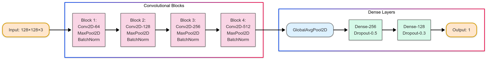

After training and testing our model on the UTKFace dataset until we got results we were happy with, we then applied it to the NamUs data:
  - Used [namus-scraper GitHub Repository](https://github.com/Prepager/namus-scraper) to scrape missing persons data from from the NamUs database

### Face Recognition Pipeline

`compare_faces.py`

1. **Data Collection**: As mentioned above, we used [namus-scraper GitHub Repository](https://github.com/Prepager/namus-scraper) to scrape missing persons data from from the NamUs database
2. **Face Detection and Extraction**: We identified and isolated missing persons' faces with 20% padding
3. **Feature Embedding Generation**: Extracted 512D feature vectors with ArcFace model
4. **Similarity Computation**: Computed cosine similarity between the face embeddings
5. **Threshold-Based Matching**: Implemented threshold-based matching to make sure only good matches are returned
6. **Visualization and Evaluation**: Generated visualizations for user to compare matches side-by-side and input whether they are a match, no, or unsure (skip)
  - After that, evaluation metrics were computed and visualized

## Results

### Age Estimation Performance

Our custom CNN age estimation model's performance is as follows:

| Age Group | Count | MAE (years) |
|-----------|-------|-------------|
| 0-15      | 732   | 6.65        |
| 16-30     | 1651  | 8.05        |
| 31-45     | 1143  | 7.71        |
| 46-60     | 681   | 9.04        |
| 61-75     | 331   | 9.59        |
| 76+       | 201   | 14.10       |

The following test results' plots and above table, of course, are once againbased on the UTKFace's data.

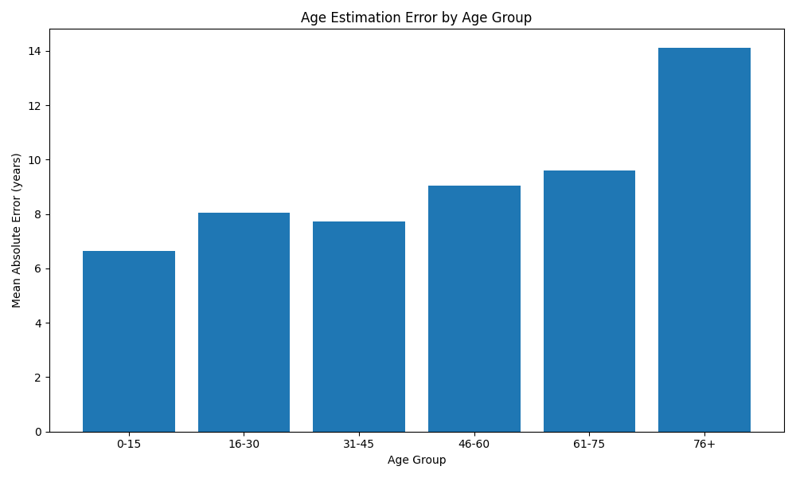

The following is a scatter plot showing the correlation between predicted ages and and actual ages:

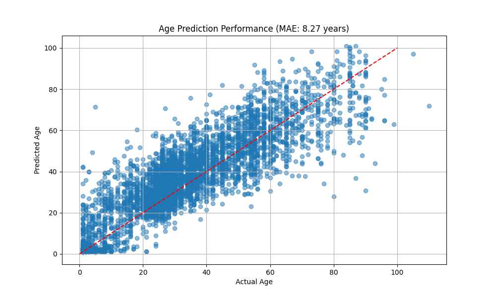

#### Validation Process

To reiterate, before running our age-estimation model on NamUS data, we first validated on the labeled UTKFace dataset. The following results, however, are from unlabeled NamUS data, with which we determine the age of the individual based on their appearace using the model:

#### Examples of Age Estimation Outputs

The following examples are case studies showing how our model perfomed with NamUs data:

##### Example 1: Elderly Individual (ID: 2773_115)
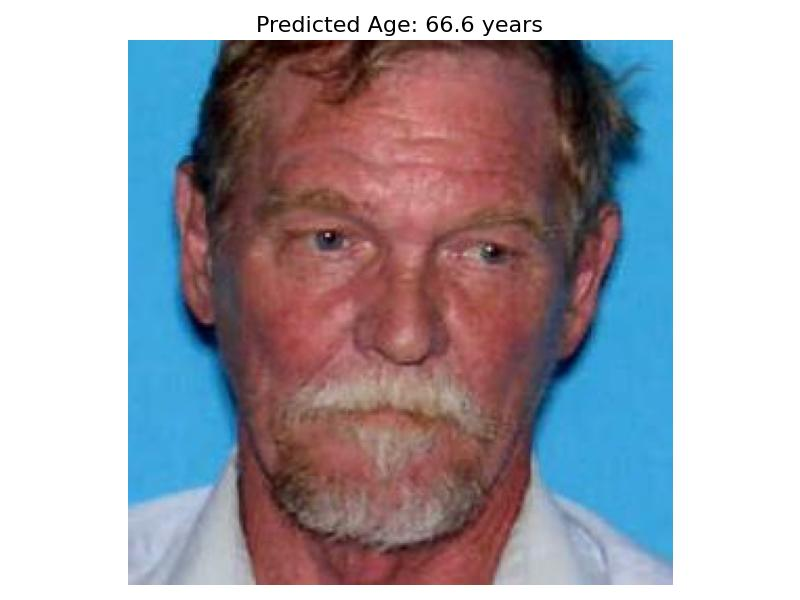

Our CNN predicted this man to be 66.6, which based on visual inspection, seems to be a decent guess..

##### Example 2: Middle-Aged Individual (ID: 21001_45)
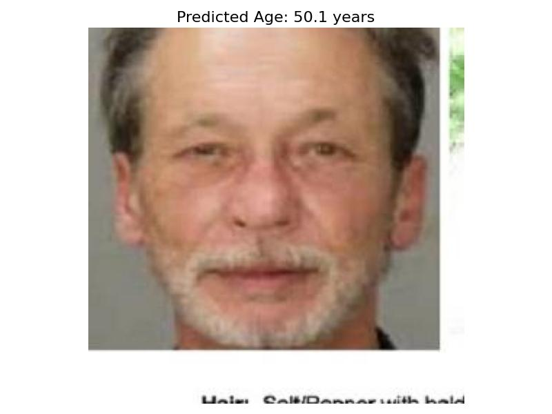

Our model predicted this this man to be 50.1 years old, which also aligns with his visible features.

##### Example 3: Incorrect Estimation (ID: 531837_5)
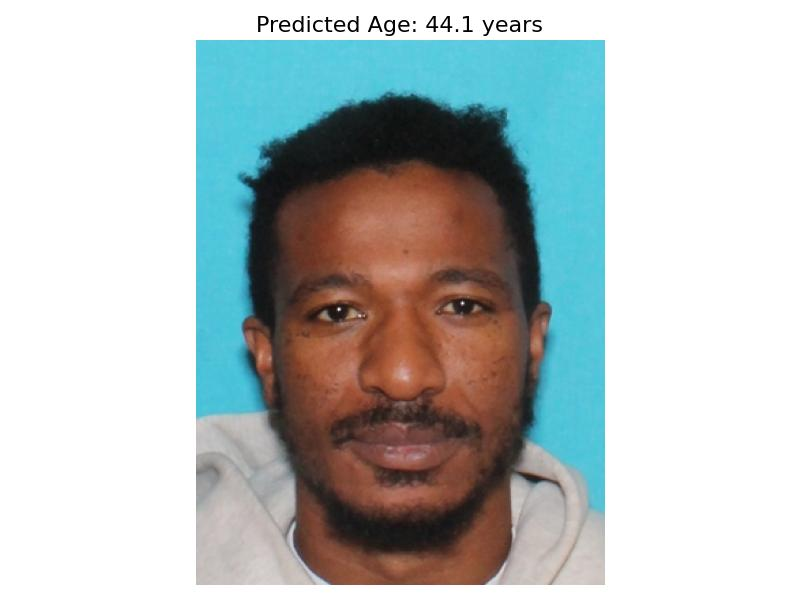

Here, our model predicts an age of 44.1 years, which is clearly a bit too high, ashe seems to be younger, (based on visual inspection he seems to be between his 20s and 30s).

This shows that our CNN has room for improvement, as a pretty clearly 20-30-something year old man is being misclassified as older. We can solve this in the future by perhaps using a large dataset or further tuning our model.

### Face Matching Performance

```
FACE MATCHING EVALUATION SUMMARY:

Precision: 100.0%
Recall: 41.9%
F1 Score: 59.0%
Accuracy: 47.9%

True Positives: 18
False Positives: 0
True Negatives: 5
False Negatives: 25

Total Evaluations: 48
```

On a test set of 48 images, our face-matching system attains a **100% precision** with only a **41.9%** recall. This shows us that our matching system is good at finding matches, but not for all cases.

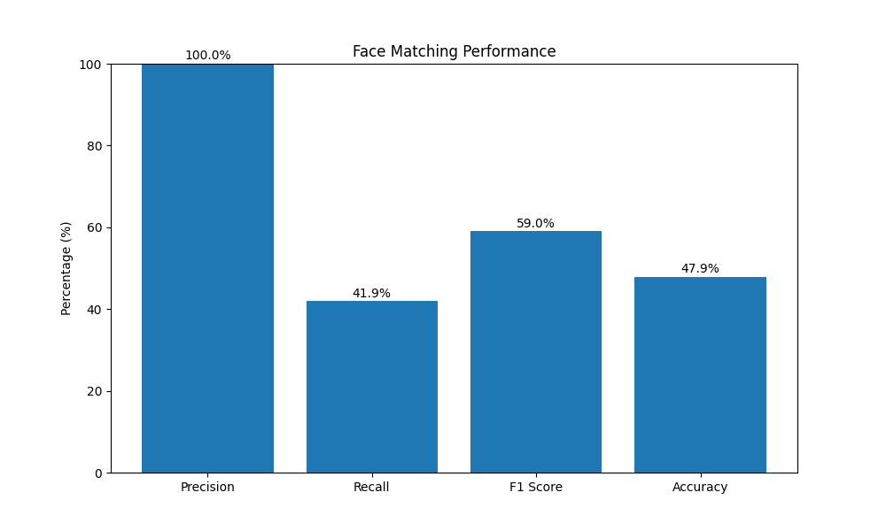

### Example Matches

#### High Confidence Match (0.7478)
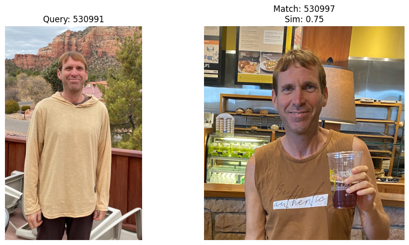

#### Medium Confidence Match (0.6109)
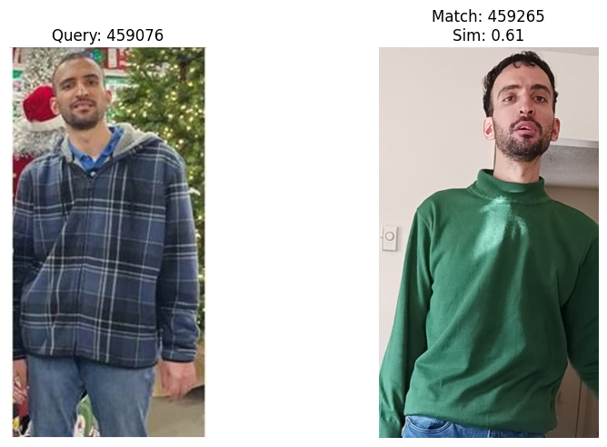

#### Lower Confidence Match (0.4896)
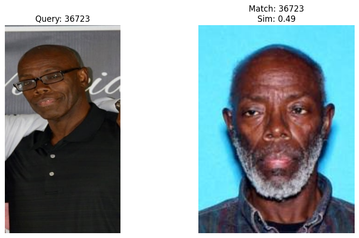

#### Lower Confidence Match (0.4767)
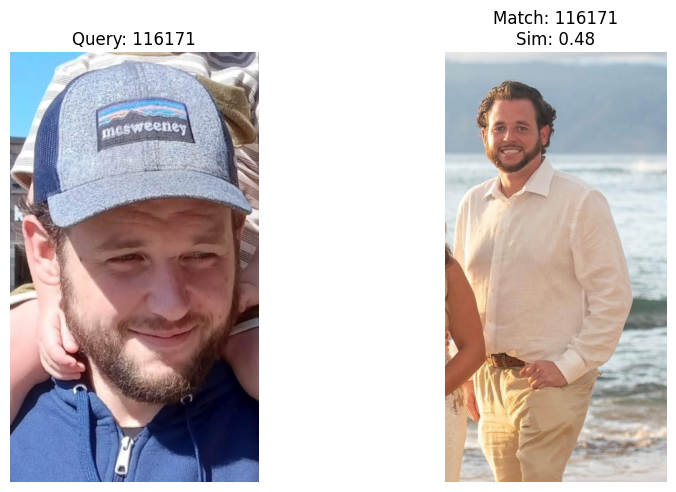

### System Limitations

#### Age and Race Variation Challenge (0.2173)
Racial bias in AI is a problem that is unfortunately prevalent in the tech, and we were even able to find some examples of this with ArcFace. Upon manual validation, we found that some darker-skinned individuals were misclassified with .2+ similarly scores, despite in many cases having a large age differnce. This is certainy an area of improvement.

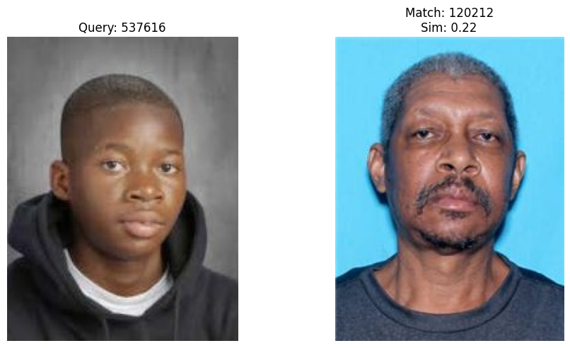

## Installation

```
forked-namus-scraper
├── process-faces.py             (to process faces)
├── README.md                    (different README.md, just for scraping) 
├── scrape-data.py               (to scrape metadata)
└── scrape-files.py              (to scrape images)
model/                           (age estimation CNN)
├── checkpoints/
│   ├── age_estimation_model.keras
│   ├── age_group_mae.png        (age group MAE plot)
│   ├── age_group_performance.csv
│   ├── best_model.weights.h5
│   ├── latest_model.weights.h5
│   ├── model_checkpoint.h5
│   ├── model_checkpoint.weights.h5
│   ├── prediction_scatter.png   (prediction scatter plot)
│   ├── training_state.backup.json
│   └── training_state.json
├── faces/                       (faces from NamUS)
├── output
│   ├── visualizations/          (visualizations of age estimation)
│   ├── age_predictions.csv
│   └── age_summary.csv
├── UTKFace/                     (training and testing data; .gitignored)
└── model.py                     (age estimation CNN)
output
├── embeddings/                  (embeddings from ArcFace)
├── encodings/                   (encodings from ArcFace)
├── evaluation/
│   ├── evaluation_summary.txt
│   ├── manual_validations.json
│   ├── performance.png          (performance metrics on matching)
│   └── plotting.py              (evaluation plot)
├── faces/                       (faces from NamUS)
├── match_comparisons/           (visualizations of matches)
├── MissingPersons/              (.gitignored)
├── UnclaimedPersons/            (.gitignored)
└── UnidentifiedPersons/         (.gitignored)
venv/                            (.gitignored)
.gitignore                       (to ignore heavy NamUS and UTKFace data)
compare_faces.py                 (to compare faces)
organize_faces.py                (to organize faces)
evaluation.py                    (to evaluate face-matching)
README.md                        (this file)
requirements.txt     
```

### Age Estimation

- After downloading the UTKFace dataset, and storing the UTKFace folder in the model folder, you should then be able to run the age estimation model.

- For NamUS data, you first need to download it by cd'ing into the forked-namus-scraper folder and following the instructions in its README.md.
 - After that, you should have it in the main directory in a folder called `output`
 - The structure should be as follows:

```
output/
├── MissingPersons/
├── UnclaimedPersons/
└── UnidentifiedPersons/
```

## Usage

```bash
pip install -r requirements.txt

# age estimation
python model/model.py

# face matching
python compare_faces.py # to compare faces with each other
python organize_faces.py # to organize faces in proper convention for our code
python evaluation.py --manual_validation # for evaluating face matches (manually)
```

## Future Work

- Improving age estimation model
- Racial AI bias investigation and elimination/minimization
- Link to Google Images API for more data
- Web interface and integration with law enforcement databases

## Acknowledgments

- Dr. Xialong Wang's ECE176 course content, assignments, and slides (UC San Diego) 
- National Missing and Unidentified Persons System ([NamUs](https://namus.nij.ojp.gov/)) for missing persons data
- UTKFace dataset for age estimation training data
- [namus-scraper](https://github.com/Prepager/namus-scraper) for allowing us to scrape images from NamUS
- InsightFace for ArcFace model
